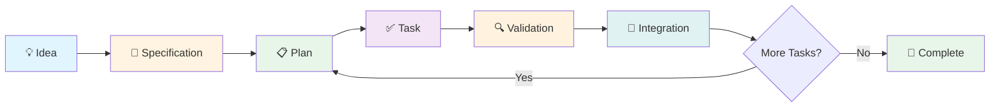
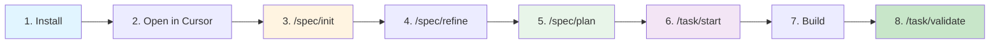

<div align="center">

# 🚀 Spec-Driven Development

### Professional AI-powered workflow system for building software with clarity, correctness, and confidence

[](LICENSE)
[](https://github.com/eskoubar95/spec)
[](https://nodejs.org/)
[](CONTRIBUTING.md)

**Transform your development workflow with AI-powered specification-driven development inside Cursor IDE**

[📖 Documentation](#-table-of-contents) • [🚀 Quick Start](#-quick-start) • [📦 Installation](#-installation) • [💡 Examples](#-examples) • [🤝 Contributing](#-contributing)

---

</div>

## 📋 Table of Contents

| Section | Description |
|---------|-------------|
| [🎯 What is SDD?](#-what-is-spec-driven-development) | Core concepts and principles |
| [✨ Key Features](#-key-features) | What makes SDD powerful |
| [🏗️ System Architecture](#️-system-architecture) | How it all works together |
| [⚡ Quick Start](#-quick-start) | Get started in 5 minutes |
| [🛠️ CLI Tool](#️-cli-tool) | Command-line interface |
| [📚 Complete Workflow](#-complete-workflow-guide) | Step-by-step guides |
| [🔗 Integrations](#-integrations) | Linear, GitHub, Context7 |
| [🏢 Enterprise Adoption](#-adopting-sdd-in-existing-projects) | Adopt in existing projects |
| [💾 Token Efficiency](#-token-efficiency) | Optimized for AI interactions |
| [❓ Troubleshooting](#-troubleshooting) | Common issues and solutions |

---

## 🎯 What is Spec-Driven Development?

**Spec-Driven Development (SDD)** is a methodology where **the specification is the source of truth**. It enforces professional discipline, prevents scope creep, and enables seamless AI collaboration.

### The SDD Lifecycle



### Core Principles

| Principle | Description |
|-----------|-------------|
| **📝 Specifications define intent** | Code implements intent, not the other way around |
| **🚫 No assumptions** | If it's not in the spec, it doesn't exist |
| **🔄 Explicit transitions** | Clear phases with defined entry/exit criteria |
| **📈 Continuous evolution** | Specs evolve throughout the project lifecycle |
| **🔗 Traceability** | Every line of code traces back to a spec requirement |

### Why SDD?

| Benefit | Description |
|---------|-------------|
| ✅ **Avoid vibe-coding** | No more "let's just try this and see" |
| ✅ **Prevent scope creep** | Clear boundaries enforced by the system |
| ✅ **Enable AI collaboration** | AI agents work best with explicit intent |
| ✅ **Maintain alignment** | Spec, code, and validation stay synchronized |
| ✅ **Professional discipline** | Work like a senior engineer from day one |

---

## ✨ Key Features

### 🎯 Smart Command System

| Feature | Details |
|---------|---------|
| **9 Core Commands** | Complete project lifecycle management (+ optional batching) |
| **Auto-Detection** | Project type, size, phase, and technologies |
| **Dynamic Rules** | Framework-specific rules auto-activated |
| **Hybrid Structure** | Adapts to simple and complex projects |

### 🤖 Cursor 2.4+: Skills + Subagents (optional)

| Layer | Purpose | How to use |
|------|---------|------------|
| **Skills** | Small, reusable procedures (git hygiene, validation, design bootstrap) | Invoke explicitly (e.g. `/sdd-git-default-branch`) or reference inside commands |
| **Subagents** | Long-running/batched work + independent verification | Use `batch-runner` for `/task/batch`-style runs and `verifier` as a pre-PR quality gate |

### 🔗 Deep Integrations

| Integration | Capabilities |
|-------------|--------------|
| **Linear** | Automatic issue sync, document creation, status updates |
| **GitHub** | PR automation, CodeRabbit integration, workflow generation |
| **Context7** | Dynamic documentation lookup for any framework |
| **Testing** | Automatic test execution, coverage tracking, failure detection |
| **Performance** | Lighthouse audits, regression detection, metrics tracking |

### 🚀 Automation & Intelligence

| Capability | Description |
|------------|-------------|
| **Git Workflow** | Smart commits, PR descriptions, state tracking |
| **Error Recovery** | Automatic detection and resolution of common issues |
| **Refactoring Analysis** | Code quality checks with framework-agnostic patterns |
| **Memory System** | OpenMemory integration for accumulated project knowledge |

### ⚡ Token Efficiency

| Optimization | Impact |
|--------------|--------|
| **Conditional Loading** | ~33% token reduction (only load helpers when needed) |
| **Section-Specific Reading** | Read only relevant parts of large files |
| **Metadata Caching** | Fast rule activation without re-reading files |
| **Smart Dependencies** | Automatic dependency resolution for helpers |

---

## 🏗️ System Architecture

### Component Overview

```
┌─────────────────────────────────────────────────────────────┐
│                    Cursor IDE Workspace                      │
├─────────────────────────────────────────────────────────────┤
│                                                               │
│  .cursor/                                                    │
│  ├── commands/          # Workflow commands (your interface)│
│  │   ├── spec/          # Specification commands            │
│  │   ├── task/          # Task execution commands           │
│  │   ├── tools/         # Utility commands                  │
│  │   └── _shared/       # 17 shared helpers (conditional)   │
│  │                                                           │
│  ├── skills/            # Reusable procedures (Cursor 2.4+)  │
│  ├── agents/            # Subagents (Cursor 2.4+)            │
│  │                                                           │
│  ├── rules/             # Behavioral rules (always-on)      │
│  │   ├── 00-pos.mdc     # Project Operating System          │
│  │   ├── 01-sdd.mdc     # Spec-Driven Development           │
│  │   ├── 02-work-mode.mdc # Execution discipline            │
│  │   ├── 10-engineering.mdc # Engineering patterns          │
│  │   ├── 11-design.mdc  # Design system patterns            │
│  │   ├── 12-business.mdc # Business analysis                │
│  │   ├── 20-nextjs.mdc  # Next.js patterns (auto-activated) │
│  │   ├── 21-api-design.mdc # API design patterns            │
│  │   ├── 30-database.mdc # Database patterns                │
│  │   ├── 31-testing.mdc # Testing patterns                  │
│  │   └── openmemory.mdc # Memory system integration         │
│  │                                                           │
│  └── scripts/           # Validation and automation         │
│                                                               │
│  spec/                  # Source of truth (generated)        │
│  work/                  # Execution artifacts (generated)    │
│  .sdd/                  # Cache and state management         │
│                                                               │
└─────────────────────────────────────────────────────────────┘
```

### Workflow Diagram

```mermaid
graph TD
    A[💡 Idea] --> B[/spec/init]
    B --> C{Clear enough?}
    C -->|No| D[/spec/refine]
    D --> C
    C -->|Yes| E[/spec/plan]
    E --> F[/task/start]
    F --> G[🛠️ Implementation]
    G --> H[/task/validate]
    H --> I{Validation passed?}
    I -->|No| J[Fix issues]
    J --> H
    I -->|Yes| K[/tools/refactor]
    K --> L{Refactoring needed?}
    L -->|Yes| M[Apply refactoring]
    M --> H
    L -->|No| N[✅ Complete]
    N --> O{More tasks?}
    O -->|Yes| F
    O -->|No| P[🚀 Project Complete]
    
    style A fill:#e1f5ff
    style B fill:#fff4e1
    style E fill:#e8f5e9
    style F fill:#f3e5f5
    style H fill:#fff3e0
    style K fill:#fce4ec
    style N fill:#e8f5e9
    style P fill:#c8e6c9
```

### Integration Flow

```mermaid
graph LR
    A[Command] --> B{Detection}
    B --> C[Rule Activation]
    C --> D[Execution]
    D --> E{Linear enabled?}
    E -->|Yes| F[Linear Automation]
    E -->|No| G{GitHub PR?}
    G -->|Yes| H[CodeRabbit + PR Automation]
    G -->|No| I{Framework detected?}
    I -->|Yes| J[Documentation Lookup]
    I -->|No| K{Tests exist?}
    K -->|Yes| L[Test Automation]
    K -->|No| M{Preview URL?}
    M -->|Yes| N[Performance Monitoring]
    M -->|No| O[Complete]
    
    style A fill:#e1f5ff
    style F fill:#6366f1
    style H fill:#24292e
    style J fill:#0070f3
    style L fill:#2dd4bf
    style N fill:#fbbf24
    style O fill:#10b981
```



---

## ⚡ Quick Start

### Prerequisites

| Requirement | Version | Description |
|-------------|---------|-------------|
| **Cursor IDE** | Latest | [Download](https://cursor.sh/) |
| **Node.js** | 18+ | For CLI tool |
| **Git** | Any | For version control |
| **Linear** (Optional) | - | For task management |
| **GitHub** (Optional) | - | For CI/CD integration |

### Installation

#### Option 1: Using npx (Recommended) ⭐

```bash
# Create a new SDD project
npx @eskoubar95/spec init

# Follow the interactive prompts:
# ✓ Project name: my-awesome-project
# ✓ Task mode: local (or linear if you have Linear)
# ✓ Initialize git: yes
```

#### Option 2: GitHub npx

```bash
# Install directly from GitHub
npx github:eskoubar95/spec init
```

#### Option 3: Clone Template

```bash
# Clone this repository
git clone https://github.com/eskoubar95/spec.git
cd spec

# Copy template to your project
cp -r template/ ../my-awesome-project/
cd ../my-awesome-project
```

### First Steps



#### Step-by-Step Guide

1. **Open project in Cursor**
   ```bash
   cursor .
   ```

2. **Initialize your specification**
   ```
   /spec/init
   ```
   
   **Example prompt:**
   ```
   I want to build a SaaS platform for freelancers to manage their 
   clients, projects, and invoices. It should have authentication, 
   a dashboard, project tracking, and PDF invoice generation.
   ```

3. **Refine if needed** (optional)
   ```
   /spec/refine
   ```
   
   **Example prompt:**
   ```
   Can we clarify the authentication requirements? Should we support 
   social login? What about multi-factor authentication?
   ```

4. **Create execution plan**
   ```
   /spec/plan
   ```
   
   **Example prompt:**
   ```
   Create a plan with milestones and tasks. Prioritize authentication 
   and basic dashboard first.
   ```

5. **Start first task**
   ```
   /task/start
   ```
   
   **Example prompt:**
   ```
   Let's start with T1.1 - Set up authentication
   ```

---

## 🛠️ CLI Tool

The SDD CLI provides powerful commands for managing your projects.

### Installation

```bash
# Install globally (optional)
npm install -g @eskoubar95/spec

# Or use with npx (recommended)
npx @eskoubar95/spec <command>
```

### Commands

| Command | Description | Usage |
|---------|-------------|-------|
| **`init`** | Create a new SDD project | `spec init` |
| **`install`** | Install SDD to existing project | `spec install [path]` |
| **`update`** | Update SDD in existing installation | `spec update [path]` |
| **`workspace`** | Open project in Cursor IDE | `spec workspace [path]` |
| **`help`** | Show help information | `spec help` |

### Command Details

#### `spec init` - Create New Project

Creates a new SDD project from template.

**Features:**
- ✅ Interactive prompts for project configuration
- ✅ Smart mode detection (auto-suggests install in Cursor)
- ✅ Project name normalization (spaces → hyphens)
- ✅ Git initialization (optional)
- ✅ Linear mode support
- ✅ Auto-open in Cursor (optional)

**Example:**
```bash
$ spec init
? Project name: my-awesome-project
? Task mode: (Use arrow keys)
  ❯ local
    linear
? Initialize git? (Y/n) y
? Open in Cursor? (Y/n) y

✓ Project created at ./my-awesome-project
✓ SDD system installed
✓ Git initialized
✓ Opening in Cursor...
```

#### `spec install` - Install to Existing Project

Installs SDD system into an existing project.

**Features:**
- ✅ Backup existing `.cursor` folder
- ✅ Merge or overwrite strategies
- ✅ Selective installation (spec/work folders)
- ✅ Existing project detection
- ✅ Root spec creation with marking

**Example:**
```bash
$ spec install ./my-existing-project
? Project path: ./my-existing-project
? Backup strategy: (Use arrow keys)
  ❯ backup (create timestamped backup)
    merge (preserve existing files)
? Install spec/work folders? (Y/n) y
? Create root spec? (Y/n) y
✓ Installing SDD system...
✓ Backup created: .cursor/_backup_2024-01-15T10-30-00
✓ Installation complete!
```

#### `spec update` - Update SDD System

Updates SDD system in an existing installation.

**Features:**
- ✅ Version checking
- ✅ Backup before update
- ✅ Incremental updates
- ✅ Version tracking

**Example:**
```bash
$ spec update
? Checking for updates...
✓ Current version: 0.1.0
✓ Latest version: 0.2.0
? Update available. Update now? (Y/n) y
✓ Backing up current installation...
✓ Updating to v0.2.0...
✓ Update complete!
```

#### `spec workspace` - Open in Cursor

Opens a project in Cursor IDE.

**Features:**
- ✅ Detects if already in Cursor
- ✅ Supports custom paths
- ✅ Works with both new and existing projects

**Example:**
```bash
$ spec workspace ./my-project
✓ Opening ./my-project in Cursor...
```

### Local Development

```bash
# Clone repository
git clone https://github.com/eskoubar95/spec.git
cd spec

# Install CLI dependencies
cd cli
npm install

# Build CLI
npm run build

# Test CLI locally
node dist/index.js init
# or
npm start init
```

---

## 📚 Complete Workflow Guide

### Phase 1: Specification

#### `/spec/init` - Initialize Specification

**When to use:**
- ✅ Starting a brand new project
- ✅ You have an idea but no formal specification
- ✅ Need to pitch a concept and capture requirements

**What it creates:**
- `spec/00-root-spec.md` – Core project specification
- `spec/03-risks.md` – Identified risks and mitigation strategies
- `spec/04-open-questions.md` – Unresolved questions requiring clarification
- `spec/05-decisions.md` – Key architectural and technical decisions
- `spec/08-infrastructure.md` – Technology stack and infrastructure choices
- `spec/07-design-system.md` – Design system (recommended when UI design impacts implementation)

**Example prompts:**

```yaml
Basic project:
  "I want to build a personal blog with Next.js, Tailwind, and MDX for content."

Complex project:
  "I'm building a multi-tenant SaaS platform for real estate agents. 
  It needs property listings, client management, document storage, 
  e-signatures, and payment processing. Target: 1000+ agents."

Migration project:
  "I need to migrate our legacy PHP application to Next.js. 
  Current features: user auth, product catalog, shopping cart, 
  admin panel. Must maintain feature parity."
```

#### `/spec/refine` - Refine Specification

**When to use:**
- ✅ The spec feels fuzzy or incomplete
- ✅ Stakeholders have new questions
- ✅ You discover missing requirements
- ✅ Scope boundaries are unclear

**Example prompts:**

```yaml
Clarification:
  "The authentication section is unclear. Should we support OAuth? 
  Which providers? What about email/password?"

Scope adjustment:
  "We need to add real-time notifications. How does this impact 
  the architecture and timeline?"

Risk mitigation:
  "I'm concerned about the file upload feature. What are the 
  security implications? Should we use a CDN?"
```

#### `/spec/plan` - Create Execution Plan

**When to use:**
- ✅ Specification is clear and stable
- ✅ Ready to break down work into tasks
- ✅ Need to estimate timeline and milestones

**What it creates:**
- `work/backlog/milestones.md` – Project milestones with goals and deadlines
- `work/backlog/tasks.local.md` – Detailed task breakdown (local mode)
- Linear project + issues (if Linear mode enabled)
- `spec/01-prd.md` – Product Requirements Document (if needed)
- `spec/06-acceptance.md` – Acceptance criteria (if needed)
- `.github/workflows/` – CI/CD workflows based on project complexity

**Example prompts:**

```yaml
Basic planning:
  "Create a plan with milestones and tasks. I want to launch an MVP 
  in 4 weeks."

Prioritized planning:
  "Break this down into phases. Phase 1 should be the minimum viable 
  product. Phase 2 can include nice-to-have features."

Team-based planning:
  "We have 3 developers. Create parallel workstreams for frontend, 
  backend, and infrastructure."
```

### Phase 2: Execution

#### `/task/start` - Start Task Implementation

**When to use:**
- ✅ Ready to implement a specific task
- ✅ Need to lock scope and define acceptance criteria
- ✅ Want to initialize Git workflow for the task

**What it does:**
- ✅ Creates Git branch (e.g., `task/T1.1-setup-authentication`)
- ✅ Syncs with Linear issue (if Linear mode)
- ✅ Creates task-level spec (if complex task)
- ✅ Activates framework-specific rules based on tech stack
- ✅ Fetches documentation (Context7) if needed
- ✅ Initializes Git state tracking

#### `/task/validate` - Validate Completed Task

**When to use:**
- ✅ Task implementation is complete
- ✅ Ready to verify correctness and quality
- ✅ Want to create PR and deploy preview

**What it does:**
- ✅ Runs linting and type checking
- ✅ Executes tests (if test framework detected)
- ✅ Checks test coverage
- ✅ Analyzes code quality
- ✅ Handles CodeRabbit comments (if PR exists)
- ✅ Generates commit message and PR description
- ✅ Creates GitHub PR with preview deployment
- ✅ Updates Linear issue status (if Linear mode)
- ✅ Runs performance monitoring (if enabled)

### Phase 3: Quality & Optimization

#### `/tools/refactor` - Analyze Code Quality

**When to use:**
- ✅ Task is complete but code feels messy
- ✅ Files are getting too large (>300 lines)
- ✅ Functions are too complex (>50 lines)
- ✅ Code duplication detected
- ✅ Want to improve code quality before PR

**What it checks:**
- File size (warns if >300 lines, critical if >500 lines)
- Function size (warns if >50 lines, critical if >100 lines)
- Cyclomatic complexity (warns if >10, critical if >20)
- Code duplication (DRY principle violations)
- Single Responsibility Principle violations
- Separation of concerns
- Code clarity and readability
- Framework-specific patterns (via Context7 docs)

---

## 🔗 Integrations

### Linear Integration

**Setup:**

1. Install Linear MCP in Cursor settings
2. Configure in `work/linear/sync-config.md`:
   ```yaml
   LINEAR_MODE: true
   MCP_CONNECTION_NAME: linear
   AUTO_CREATE_DOCUMENTS: true
   AUTO_UPDATE_STATUS: true
   ```

**Features:**
- ✅ Automatic project creation during `/spec/plan`
- ✅ Issue creation with labels, status, and assignees
- ✅ Document creation for specs and architecture
- ✅ Status updates during task lifecycle
- ✅ Comment sync for task updates
- ✅ Cycle management for sprints

**Example workflow:**
```
/spec/plan → Creates Linear project + issues
/task/start T1.1 → Syncs with Linear issue, sets status to "In Progress"
/task/validate → Updates status to "In Review", adds comment with PR link
```

### GitHub Integration

**Setup:**

1. Install GitHub MCP in Cursor settings (or use GitHub CLI)
2. Configure in `.github/workflows/` (auto-generated during `/spec/plan`)

**Features:**
- ✅ Automatic workflow generation (tests, linting, build checks)
- ✅ PR creation with detailed descriptions
- ✅ CodeRabbit comment detection and resolution
- ✅ Preview deployment automation
- ✅ State tracking (branch, PR, deployment)

**Example workflow:**
```
/task/start → Creates Git branch, initializes state tracking
[Implementation]
/task/validate → Creates PR, triggers workflows, deploys preview
[CodeRabbit reviews]
System auto-resolves CodeRabbit comments as issues are fixed
```

### Context7 Documentation Lookup

**Setup:**

1. Install Context7 MCP in Cursor settings
2. No additional configuration needed

**Features:**
- ✅ Automatic framework detection from tech stack
- ✅ Dynamic documentation lookup (no hardcoded library IDs)
- ✅ Cache management for faster lookups
- ✅ Fallback to Cursor indexing and web search

**Example workflow:**
```
/task/start → Detects Next.js from spec/08-infrastructure.md
System queries Context7: "Next.js 15 server components best practices"
AI uses fresh documentation for implementation
```

---

## 🏢 Adopting SDD in Existing Projects

SDD works beautifully for new projects, but it's equally powerful for existing enterprise codebases. Whether you're working with legacy systems, large monoliths, or microservices, SDD can help you document, understand, and improve what already exists.

### When to Use SDD in Existing Projects

| Scenario | Best Approach |
|----------|---------------|
| **Legacy codebases** (>6 months old) without comprehensive documentation | Retrospective workflow |
| **Team onboarding** needs faster knowledge transfer | Hybrid approach |
| **Planning major refactoring** or migration | Retrospective + planning |
| **Adopting SDD incrementally** while maintaining existing workflows | Feature-by-feature |
| **Documentation debt** affecting development velocity | Retrospective audit |

### Three Adoption Workflows

```mermaid
graph TD
    A[Existing Project] --> B{Choose Strategy}
    B -->|Complete Documentation| C[Retrospective Workflow]
    B -->|Incremental| D[Feature-by-Feature]
    B -->|Balanced| E[Hybrid Approach]
    C --> F[/spec/audit]
    F --> G[/spec/sync]
    G --> H[/spec/refine]
    H --> I[/spec/plan]
    D --> J[/spec/init with Context]
    J --> K[Normal SDD Workflow]
    E --> L[Start Retrospective]
    L --> M[Adopt for New Features]
    
    style A fill:#e1f5ff
    style C fill:#fff4e1
    style D fill:#e8f5e9
    style E fill:#f3e5f5
```

### 1. Retrospective Spec Creation (Complete Documentation)

**Best for:** Starting fresh with existing codebase, need comprehensive documentation, planning major changes.

**Workflow:**
```
/spec/audit → /spec/sync → /spec/refine → /spec/plan
```

**Expected Outcomes:**
- ✅ Complete specification of current state
- ✅ Architecture documentation
- ✅ Technical debt inventory
- ✅ Foundation for future development
- ✅ Improved team onboarding

**Time Investment:** 1-3 days for medium projects, 1-2 weeks for large enterprise projects.

### 2. Feature-by-Feature Adoption (Incremental)

**Best for:** Large enterprise projects, can't pause development for full retrospective, gradual SDD adoption.

**Workflow:**
```
For each new feature: /spec/init → /spec/refine → /spec/plan → /task/start → /task/validate
```

**Advantages:**
- ✅ No disruption to ongoing work
- ✅ Low risk adoption
- ✅ Learn SDD while delivering features
- ✅ Build documentation naturally

### 3. Hybrid Approach (Recommended for Most)

**Best for:** Most enterprise projects - balance between complete documentation and practical delivery.

**Strategy:**
1. **Start with high-level retrospective** (Week 1)
2. **Adopt SDD for all new work** (Ongoing)
3. **Deep-dive retrospectives as needed**

---

## 💾 Token Efficiency

The SDD system is designed to minimize token consumption while maintaining high quality.

### Optimization Strategies

| Strategy | Impact | Description |
|----------|--------|-------------|
| **Conditional Helper Loading** | ~33% reduction | Only load helpers when needed |
| **Section-Specific Reading** | ~50% reduction | Read only relevant parts of large files |
| **Metadata Caching** | Instant activation | Fast rule activation without re-reading |
| **Smart Dependencies** | Automatic | Auto-load dependencies when needed |

### Token Usage by Command

| Command | Helpers Loaded | Approx. Tokens | Use Case |
|---------|----------------|----------------|----------|
| `/spec/init` | 2 | ~6,000 | Project initialization |
| `/spec/refine` | 3 | ~9,000 | Specification refinement |
| `/spec/plan` | 6 | ~18,000 | Planning with integrations |
| `/task/start` | 5 | ~15,000 | Task start with docs lookup |
| `/task/validate` | 8 | ~24,000 | Full validation with all checks |
| `/tools/refactor` | 4 | ~12,000 | Code quality analysis |

**Total savings:** ~33% compared to loading all helpers for every command.

### Before vs After Optimization


---

## 📊 Command Reference

### Specification Commands

| Command | Purpose | When to Use | Output |
|---------|---------|-------------|--------|
| `/spec/init` | Initialize project spec | Starting new project | `spec/00-root-spec.md`, risks, questions |
| `/spec/refine` | Refine specification | Spec is unclear or incomplete | Updated spec sections |
| `/spec/plan` | Create execution plan | Spec is clear, ready to plan | Milestones, tasks, Linear project |
| `/spec/audit` | Audit spec compliance | Verify spec-code alignment | Audit report with findings |
| `/spec/sync` | Sync spec with reality | Implementation diverged from spec | Updated spec files |
| `/spec/evolve` | Evolve spec for new phase | Project entering new phase | Updated spec for new context |

### Task Commands

| Command | Purpose | When to Use | Output |
|---------|---------|-------------|--------|
| `/task/start` | Start task implementation | Ready to code | Git branch, task context, rules activated |
| `/task/validate` | Validate completed task | Task complete, ready to verify | Validation report, PR creation |
| `/task/batch` | Execute a milestone/task list sequentially | Multiple tasks need execution with discipline | Per-task outcomes + validation evidence |

### Tool Commands

| Command | Purpose | When to Use | Output |
|---------|---------|-------------|--------|
| `/tools/refactor` | Analyze code quality | After task completion | Refactoring suggestions, quality metrics |

---

## ❓ Troubleshooting

### Common Issues

<details>
<summary><strong>Issue: "Spec is unclear, can't proceed with planning"</strong></summary>

**Solution:**
```
/spec/refine

Prompt: "The authentication section is unclear. What specific 
authentication methods should we support? What are the security 
requirements?"
```
</details>

<details>
<summary><strong>Issue: "Task validation failed, tests are failing"</strong></summary>

**Solution:**
```
1. Review test failures in validation report
2. Fix failing tests
3. Run /task/validate again
4. Repeat until all tests pass
```
</details>

<details>
<summary><strong>Issue: "Linear sync is not working"</strong></summary>

**Solution:**
```
1. Check work/linear/sync-config.md:
   - LINEAR_MODE: true
   - MCP_CONNECTION_NAME: <your-connection-name>

2. Verify Linear MCP is installed in Cursor settings

3. Check .sdd/linear-state.json for errors

4. Re-run /spec/plan to recreate Linear project
```
</details>

<details>
<summary><strong>Issue: "Documentation lookup is not finding the right docs"</strong></summary>

**Solution:**
```
1. Verify tech stack is documented in spec/08-infrastructure.md

2. Check Context7 MCP is installed and working:
   Test manually: "Find Next.js 15 documentation"

3. System will fallback to:
   - Cursor's indexed documentation
   - Web search

4. If still failing, provide explicit documentation links in spec
```
</details>

---

## 🎯 Best Practices

| Practice | Good ✅ | Bad ❌ |
|----------|---------|--------|
| **Start Small** | Start with `/spec/init`, refine until clear, then plan | Jump straight to implementation without spec |
| **One Task at a Time** | `/task/start T1.1` → Complete → `/task/validate` → Next task | Start multiple tasks simultaneously |
| **Validate Before Merging** | `/task/validate` → Fix issues → Validate again → Merge | Skip validation and merge directly |
| **Use Refactoring Proactively** | `/task/validate` → `/tools/refactor` → Fix quality issues → Validate again | Accumulate technical debt, refactor later (never happens) |
| **Keep Specs Synchronized** | Implementation reveals new requirement → Update spec first → Continue | Implement new feature without updating spec |
| **Leverage Integrations** | Use Linear for task management, GitHub for CI/CD, Context7 for docs | Manual task tracking, no automation |
| **Trust the Process** | Follow the workflow even when it feels slow initially | Skip steps because "this is a simple task" |

---

## 🤝 Contributing

We welcome contributions! Please see [CONTRIBUTING.md](CONTRIBUTING.md) for guidelines.

### Development Setup

```bash
# Clone repository
git clone https://github.com/eskoubar95/spec.git
cd spec

# Install CLI dependencies
cd cli
npm install

# Build CLI
npm run build

# Test CLI locally
node dist/index.js init
```

### Running Validation Scripts

```bash
# Validate helper metadata
node .cursor/scripts/validate-helpers.cjs

# Expected output: All checks passed ✓
```

---

## 📄 License

MIT License - see [LICENSE](LICENSE) for details.

---

## 🙏 Acknowledgments

- Inspired by [spec-kit-command-cursor](https://github.com/madebyaris/spec-kit-command-cursor)
- Built for the Cursor IDE community
- Powered by Claude Sonnet 4.5

---

## 🚀 What's Next?

<div align="center">

### Ready to transform your development workflow?

```bash
# Initialize your first project
npx @eskoubar95/spec init
```

**Then open in Cursor and start with:**
```
/spec/init
```

[⭐ Star us on GitHub](https://github.com/eskoubar95/spec) • [📖 Read the Docs](#-table-of-contents) • [💬 Join Discussions](https://github.com/eskoubar95/spec/discussions)

**Happy building! 🎉**

</div>

